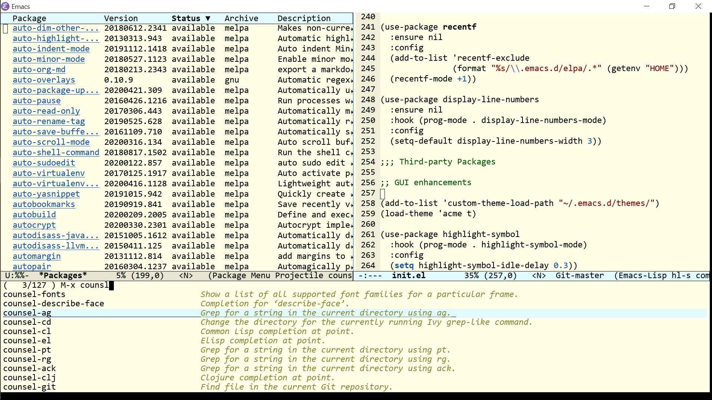
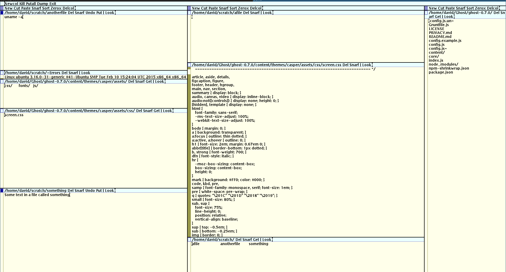

<h3 align="center">Acme Emacs Theme</h3>
<hr/>


<p align="center">
  
</p>

<p align="center">
<a href="https://github.com/ianpan870102/wilmersdorf-emacs-theme"></a>
<a href="https://github.com/ianpan870102/acme-emacs-theme"></a>
<a href="https://www.gnu.org/licenses/gpl-3.0"></a>
</p>

<p align="center">An Emacs theme with an old-school vibe</p>

<p align="center">Inspired by Plan 9 Acme & Sam</p>

<br/>
<br/>

#### Installation

`acme-theme` is now on MELPA as a package (as of 19. June. 2020)! An example use-package declaration:

```emacs-lisp
(use-package acme-theme
  :config
  (load-theme 'acme t))
```

#### Customization options:

1. Setting `acme-theme-black-fg` to `t` turns the foreground into pure black instead of the default dark grey.

```emacs-lisp
(setq acme-theme-black-fg t)
```

#### Screenshot 1
#### Emacs with acme-theme.el



#### Screenshot 2 (for comparison)
#### The original Acme editor (Sam has a similar color scheme)



Copyright© 2020 Ian Y.E. Pan

This program is free software: you can redistribute it and/or modify
it under the terms of the GNU General Public License as published by
the Free Software Foundation, either version 3 of the License, or (at
your option) any later version.

This program is distributed in the hope that it will be useful, but
WITHOUT ANY WARRANTY; without even the implied warranty of
MERCHANTABILITY or FITNESS FOR A PARTICULAR PURPOSE. See the GNU
General Public License for more details.

You should have received a copy of the GNU General Public License
along with this program. If not, see https://www.gnu.org/licenses/.
